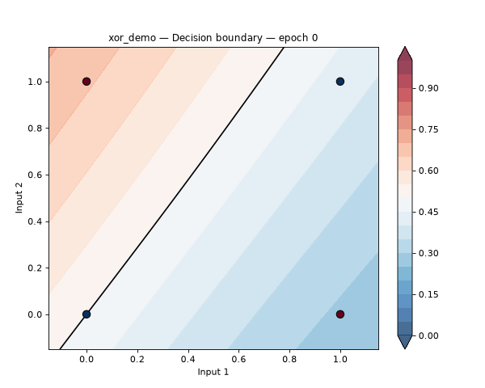
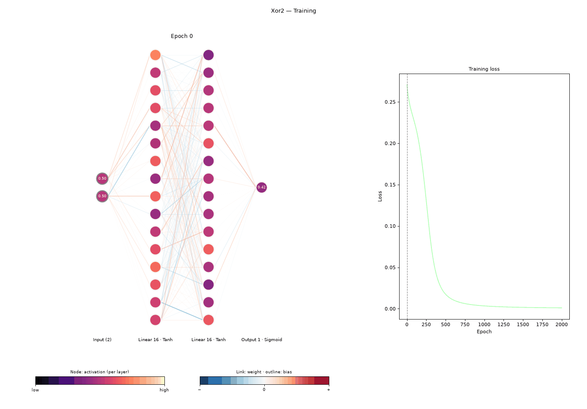
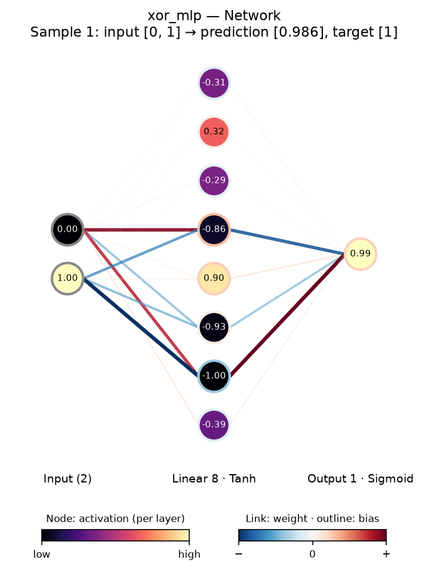
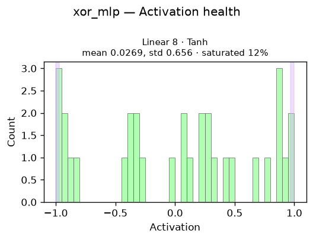

# ORBIT v0.2 — Open Research & Benchmarking Intelligence Toolkit

<p align="center">
  <!--  -->
  
</p>

## The Main Picture

ORBIT is a terminal-first toolkit for personal AI research. It enables fast and reliable iteration over different models while letting you see what is happening under the hood: the network itself, its weights and activations, and how they change as it learns.

The idea is simple: **you describe the experiment, ORBIT handles the machinery, records the results, and helps you analyze and reproduce them.** You never write a training script. An experiment is a small saved config (`experiment.json`) that you create interactively, and ORBIT's own engine (a from-scratch NumPy autograd, layers, losses and optimizers) builds and trains it.

Everything works both as direct commands (`orbit run xor_mlp`) and inside the interactive ORBIT REPL (type `orbit`, then `run xor_mlp`).

## Installation

ORBIT is developed and tested on Python 3.14.

```bash
git clone https://github.com/Sirius-Narao/ORBIT.git
cd ORBIT
python -m venv .venv
# Windows: .venv\Scripts\activate    macOS/Linux: source .venv/bin/activate

pip install -e .

# for MP4 video output (bundles ffmpeg; GIFs work without it):
pip install -e ".[video]"

# for development (pytest):
pip install -e ".[dev]"
```

## Quick start

You can begin a project in a few commands.

First, enter the ORBIT REPL with `orbit` and set up your workspace with `init`. It creates a `.orbits/` folder (in the current directory, or the path you give it) and asks for your default hyperparameters and plot theme. Every `orbit` command then uses that workspace, from any directory. Next, set up an experiment with `new`: fill in the form (dataset, layers, loss, optimizer, hyperparameters), whose answers start pre-filled with your defaults. Finally, `run <exp>` trains and tests it.

```text
orbit> init D:/research
orbit> new
orbit> run moons_mlp
```

Next, analyze the neural network with `network <exp>`, and animate the training process with `animate <exp>`:

```text
orbit> network xor_mlp --sample 1
orbit> animate xor_mlp
orbit> boundary xor_mlp --animate
```

Every image, animation and result is saved under `.orbits/experiments/<exp>/results/`.

To get started quickly, ORBIT comes with built-in datasets: `xor`, plus the 2-D toy sets `moons`, `circles`, `spirals` and `blobs` (see [Datasets](#datasets)).

## Seeing inside the network

| Command | What you get |
|---|---|
| `network <exp> [--sample N]` | A diagram of the trained network. Links are colored by weight sign (red +, blue −) and their thickness shows the weight's size. Node color shows how strongly each neuron fires, averaged over the training set or for sample `N`. Wide layers show their most active neurons. |
| `animate <exp> [--sample N] [--mp4]` | The same diagram at every recorded epoch, next to the loss curve. GIF by default, MP4 with `--mp4`. |
| `boundary <exp> [--animate] [--mp4]` | For 2-input datasets: the whole input plane colored by the model's prediction, with the data on top. `--animate` shows the boundary forming. |
| `health <exp>` | Per hidden layer: dead ReLU units and saturated Tanh/Sigmoid units, as a table and histograms. These are the usual reasons a run trains but barely learns. |
| `run <exp> --watch` | A live terminal view during training: every neuron as a colored cell, plus a loss sparkline. |
| `plot <exp> ...` | Loss, accuracy/R², gradient norm (overall or per layer), test loss and test accuracy, for one or many experiments. |

<p align="center">
  
  
</p>

`--show` (on `network`, `animate` and `boundary`) also opens the figure in a window. It works when you call `orbit` directly, but not inside the REPL.

Plots and animations come in a light or a dark theme. Set your default with `orbit config set display.theme dark`, or pick one per command with `--theme dark`.

## Experiments

An experiment is just a JSON file at `.orbits/experiments/<name>/experiment.json`. `orbit new` writes it for you, but you can also edit it by hand:

```json
{
  "name": "xor_mlp",
  "dataset": "xor",
  "model": [
    {"type": "Linear", "in_features": 2, "neurons": 8},
    {"type": "Tanh"},
    {"type": "Linear", "neurons": 1},
    {"type": "Sigmoid"}
  ],
  "loss": "MSE",
  "optimizer": "SGD",
  "learning_rate": 2.0,
  "batch_size": 4,
  "epochs": 1500,
  "seed": 42,
  "task": "binary_classification"
}
```

| Field | Values |
|---|---|
| `model` | Layers: `Linear` (`neurons`; the first one also needs `in_features`), `ReLU`, `Tanh`, `Sigmoid`, `Softmax` |
| `loss` | `MSE`, `CrossEntropy` |
| `optimizer` | `SGD` (optional `momentum`) or `Adam` (optional `betas`, `eps`) |
| `seed` | Makes the run reproducible: same weights, shuffling and split every time |
| `task` *(optional)* | Tracks a metric per epoch: `binary_classification`, `multiclass_classification`, `regression_tolerance` (with `accuracy_tolerance`, default 0.5), `regression_r2` |
| `test_split` *(optional)* | Holds out a fraction (e.g. `0.2`) for a test evaluation after training |
| `validation_split` *(optional)* | Holds out another fraction of the dataset, measured after every epoch |
| `patience` *(optional, needs `validation_split`)* | Early stopping: stop once the validation loss hasn't improved for this many epochs, keeping the best epoch's weights |
| `normalize` *(optional)* | `standard` or `minmax`. Rescales the inputs, using statistics from the training split only |
| `grad_clip` *(optional)* | Caps the gradient's size per step, which prevents runs from blowing up |
| `batch_size` *(optional)* | Default `32` |

If a run diverges (its loss becomes inf/NaN), ORBIT stops it immediately and tells you what to try instead.

## Datasets

Built-in datasets need no setup:

| Dataset | Shape |
|---|---|
| `xor` | 4 rows, 2 inputs, binary. Too small for a train/test split |
| `moons`, `circles` | 200 rows, 2 inputs, binary (needs a hidden layer) |
| `spirals` | 300 rows, 2 inputs, 3 classes (hard) |
| `blobs` | 150 rows, 2 inputs, 3 classes (easy) |

For a 3-class dataset, end the model with `Linear` 3 (no `Softmax`) and use `CrossEntropy` with the `multiclass_classification` task.

To bring your own data, import a CSV:

```bash
orbit import winequality.csv --name wine --target quality
```

`--target` names the output column(s). Every other column becomes an input. Leave `--target` out to choose interactively. The dataset is copied to `.orbits/datasets/wine/`, then shows up in `orbit new`'s dataset list.

Columns don't have to be numbers. ORBIT detects each column's type, asks you to confirm the non-numeric ones, and turns every cell into numbers:

| Type | A cell holds | Becomes |
|---|---|---|
| `numeric` | a number | itself |
| `categorical` | a label, e.g. `red` | one-hot vector; as the target, a class |
| `text` | free text | word counts over the `--vocab-size` (default 1000) most frequent words |
| `image` | a path to an image, relative to the CSV | grayscale pixels, resized to `--image-size` (default 28) square |

A CSV can't contain images itself, so an image column lists file paths; ORBIT reads the images once at import. To skip the questions, use `--yes`, or set types yourself with `--column-type COLUMN=TYPE`. For example, `--column-type digit=categorical` makes a numeric `0`–`9` label a 10-class target.

## Sweeps

A sweep trains every combination of a few settings, starting from an existing experiment:

```text
orbit> sweep create lr_search --base xor_mlp    # choose fields and values interactively
orbit> sweep start lr_search                    # resumable: re-run it after an interruption
orbit> sweep compare lr_search --test           # rank runs by their test metrics
```

You can sweep `learning_rate`, `optimizer`, `momentum`, `batch_size`, `epochs`, `seed`, `normalize`, `test_split`, `grad_clip`, `validation_split` and `patience`, plus the architecture: `hidden_width`, `hidden_depth` and `activation`. Every run is an ordinary experiment, so all the commands above work on it.

## Commands

**Experiment lifecycle**

| Command | Description |
|---|---|
| `orbit` | Open the interactive ORBIT REPL (`help` lists commands, `exit` leaves) |
| `init [path] [--yes]` | Create the workspace (`<path>/.orbits/`) and the settings file pointing to it |
| `config` / `config set <key> <value>` | Show or change the settings (workspace, defaults, theme) |
| `new` | Create an experiment interactively |
| `run [exp] [--watch]` | Train, then evaluate on the test split if there is one. With no name, it runs `new` first |
| `train <exp> [--watch]` | Train only, without the test evaluation |
| `test <exp>` | Evaluate an already-trained experiment on its test split |
| `list [--runs]` | List experiments and sweeps with their results |
| `inspect <exp>` | Show an experiment's config and results |
| `copy <exp>` | Create a new experiment from an existing one, re-asking the hyperparameters |
| `rename <old> <new>` | Rename an experiment |
| `reproduce <exp>` | Re-run an experiment and check that it gives the same result |
| `delete <exp>` / `delete --all` | Delete experiments (no confirmation) |
| `import <csv> [--name] [--target] [--column-type COL=TYPE] [--yes]` | Import a CSV dataset |

**Analysis and visualization**

| Command | Description |
|---|---|
| `compare <exp> ... [--all] [--by METRIC ... \| --test] [--plotloss] [--logscale]` | Compare experiments side by side, optionally ranked by metrics |
| `plot <exp> ... [--all] [--metrics ...] [--logscale]` | Plot metrics for one or many experiments (asks which ones if `--metrics` is omitted) |
| `plotloss <exp> [--logscale]` | Plot one experiment's loss curve |
| `network <exp> [--sample N] [--output] [--show]` | Network diagram |
| `animate <exp> [--sample N] [--gif \| --mp4] [--fps N] [--logscale] [--output] [--show]` | Training animation |
| `boundary <exp> [--animate] [--gif \| --mp4] [--fps N] [--output] [--show]` | Decision boundary (2-input datasets) |
| `health <exp> [--output]` | Dead/saturated units per hidden layer |

**Sweeps**

| Command | Description |
|---|---|
| `sweep create <name> --base <exp>` | Define a grid of values to try |
| `sweep start <name>` | Train every pending run |
| `sweep status <name>` | Show each run's status |
| `sweep compare <name> [--by METRIC ... \| --all \| --test]` | Rank the runs |
| `sweep export <name> [--output]` | Export params and metrics to CSV |
| `sweep plot <name> [--metrics ...] [--logscale]` | Plot the finished runs |
| `sweep delete <name> [--yes]` | Delete the sweep and its runs |

Add `-h` to any command for its full options, e.g. `orbit animate -h`. Every command that draws something also takes `--theme dark|light`.

## Settings

`orbit init` writes the settings file, `~/.orbit/config.toml`. Set `ORBIT_CONFIG` to use another file, for example a second workspace. You can edit it by hand or with `orbit config set`:

```toml
workspace = "D:/research/.orbits"

[defaults]          # pre-filled answers for `orbit new`
optimizer = "SGD"
learning_rate = 0.1
adam_learning_rate = 0.001
batch_size = 32
epochs = 1000
test_split = 0.2    # 0 = no split
normalize = "standard"

[display]
theme = "dark"      # or "light"
animation_format = "gif"
fps = 10
```

Defaults only pre-fill `orbit new`. Whatever you accept is saved in the experiment itself, so changing the settings later never changes an existing experiment or how it reproduces.

## Known limitations (v0.2)

- **Models:** a model is a stack of `Linear` layers and activations. There are no convolutional or recurrent layers yet, so images are seen as flat pixel vectors and text as word counts.
- **Imported datasets:** CSV only, with no missing-value handling (an empty cell in a numeric column is an error). Categories and the text vocabulary are taken from the whole file at import.
- **Interactive prompts need a real terminal:** `new`, `copy`, `sweep create` and the REPL can't read piped input (`orbit < file`). All other commands can be scripted.
- **`--show` needs Tk** to open a window. Without it, ORBIT saves the file and tells you.

## Running the tests

```bash
pip install -e ".[dev]"
python -m pytest
```

## License

MIT. See [LICENSE](LICENSE).
